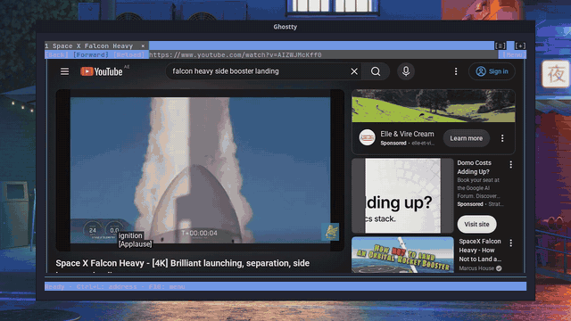

# Termium

Browse the web inside your terminal. Real pages. Real tabs. Your keyboard.

[Website](https://termium.dev/) · [Quickstart](https://termium.dev/docs/quickstart/) · [User guides](https://termium.dev/docs/) · [Installation](https://termium.dev/docs/installation/)

<p align="center">
  <a href="https://termium.dev/"></a>
  <br>
  <sub><a href="https://termium.dev/">Watch the 70-second demo with sound</a></sub>
</p>

Termium renders a real Chromium browser in your terminal, with keyboard and mouse interaction. It draws actual pixels with the Kitty graphics protocol or sixel, and falls back to ASCII graphics anywhere else. It works over SSH, so the browser can run on the machine you are logged into.

## Quickstart

Supported platforms: **Linux x86-64**, **macOS (Apple Silicon or Intel)**, and **Windows (WSL2 x86-64)**.

On Windows, open your WSL2 Linux shell in [Windows Terminal (Preview), available from the Microsoft Store](https://apps.microsoft.com/detail/9n8g5rfz9xk3). This setup is supported with Sixel graphics. Run the command below inside WSL2.

On Linux and macOS, run it directly in your terminal:

```bash
curl -fsSL https://termium.dev/install | bash
```

Setup downloads Termium, Chromium, and Vimium, verifies them, and opens the browser. No Node, Go, browser installation, or sudo required. In new terminals, the `termium` command works from any directory.

This is an early release. Linux requires glibc and working Chromium sandbox support; the installer checks compatibility; native Windows and Linux ARM64 packages are not available yet.

See [installation](docs/installation.md) for platform requirements, updates, and storage.

## Browse

Run `termium` from any directory, or `termium example.com` to open a page directly.

- The welcome page puts the key legend at your fingertips.
- Press **Ctrl+L**, type an address, and press **Enter**.
- Use the top bar for Back, Forward, Reload/Stop, and Menu.
- Press **f** for link hints, **j/k** to scroll, and **?** for Vimium help.
- Use **t**, **J/K**, and **x/X** to create, switch, close, and reopen tabs.
- Click a page field to focus it, then type normally.
- Press **F6** for mouse keys; press it again to return to typing.
- Press **Ctrl+Q**, then **Enter** to quit.

Save a custom startup and new-tab page with `termium --set-homepage https://example.com`.

Read the [getting started guide](docs/getting-started.md) for controls and display options.

## Graphics in your terminal

Termium picks the best graphics your terminal offers:

| Terminal | Graphics |
| --- | --- |
| Ghostty, Kitty, WezTerm | Kitty graphics: true color, PNG straight from Chromium |
| foot, xterm (VT340 mode), Windows Terminal | Sixel |
| Anything else, such as Alacritty | ASCII graphics with colored blocks |

See [terminal support](docs/terminals.md) for setup notes, including the xterm flags.

## Over SSH

Termium runs where you run it. SSH into a Linux machine from a terminal that supports Kitty graphics or sixel, run `termium`, and the pages render on your screen while Chromium runs on the remote host. A slow connection slows the frame rate, not the page.

## How it compares

| | Termium | [Carbonyl](https://github.com/fathyb/carbonyl) | [Browsh](https://www.brow.sh/) | Lynx, w3m |
| --- | --- | --- | --- | --- |
| Engine | Stock Chromium | Patched Chromium | Headless Firefox | Own HTML engine |
| Images and video | Real pixels (Kitty graphics, sixel), ASCII fallback | Colored block characters | Colored block characters | None, or external viewer |
| Text | Part of the rendered image | Real terminal text | Real terminal text | Real terminal text |
| Keyboard | Vimium built in: link hints, tabs, scrolling | Basic keys and mouse | Own keys and mouse | Own keys |
| Works in any terminal | Best with Kitty graphics or sixel; ASCII elsewhere | Yes | Yes | Yes |

If you want sharp terminal text on any terminal, Carbonyl and Browsh are good choices. Termium is for when you want the page to look like the page.

## Known limitations

- **Terminal multiplexers:** tmux, screen, and herdr do not work well yet. Run Termium directly in the terminal window.
- **Docker:** Chromium's sandbox needs namespaces that Docker's default seccomp profile blocks. Run the container with `--security-opt seccomp=unconfined`.
- **Text is pixels:** page text is part of the image, so you cannot select it as terminal text, and screen readers do not see it.
- **Platforms:** no native Windows or Linux ARM64 packages yet.

## Documentation

| Guide | What it covers |
| --- | --- |
| [Installation](docs/installation.md) | One-command setup, availability, and platform targets |
| [Getting started](docs/getting-started.md) | Opening pages, typing, dialogs, and quitting |
| [Terminal support](docs/terminals.md) | Graphics modes and compatibility |
| [Troubleshooting](docs/troubleshooting.md) | Display issues, startup failures, and bug reports |
| [Vimium and tabs](docs/vimium.md) | Bundled keyboard navigation, tabs, mouse coexistence, and limitations |

## What's next

1. **Multiplexers:** tmux and screen support.
2. **Distribution:** Homebrew and AUR packages, more clean-machine testing, automated dependency updates.
3. **Browser polish:** persistent browsing sessions, clipboard integration, dark mode that follows your terminal.
4. **Native Windows:** add native packages; Windows through WSL2 is supported today.

The [installation plan](docs/plans/one-command-install.md) and [browser UI plan](docs/plans/browser-ui.md) define the work and release checks. See [GitHub Releases](https://github.com/codr1/termium/releases) for native packages and release notes.

## Development

See [development](docs/development.md) for building, [testing](docs/testing.md) for the `npm test` suite and CI coverage, and [architecture](docs/architecture.md) for the rendering pipeline.

Found a bug? Follow the [reporting guide](docs/troubleshooting.md#report-a-problem) and [open an issue](https://github.com/codr1/termium/issues). Questions and ideas go in [Discussions](https://github.com/codr1/termium/discussions).

## License

[MIT](LICENSE). Third-party components retain their own licenses, included with their sources and release packages.
