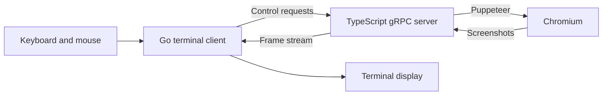

# Architecture

This page describes the current implementation. For planned changes, see [installation](plans/one-command-install.md) and [browser UI](plans/browser-ui.md).

## Browser and client

The TypeScript server controls a headless Chromium browser through Puppeteer. The Go client sends navigation, input, and viewport requests over gRPC and renders streamed screenshots in the terminal.

The protocol lives in `proto/bc.proto`; Go and TypeScript bindings are generated during the build. Dialog events use a bidirectional stream.

## Renderers

- **Kitty:** requests PNG screenshots and sends the encoded image bytes through the Kitty graphics protocol. The streaming path avoids decoding and re-encoding images on the client. It requests 30 frames per second; achieved frame rate must be measured.
- **Sixel:** decodes screenshots, quantizes colors, and encodes sixel output. Band-level caching reuses encoded regions when their contents are unchanged. Fixed palettes such as websafe support more stable caching.
- **tcell:** approximates images with Unicode character blocks. This is a screenshot renderer, not a DOM text browser.

Sixel bands are six pixels high. Caching at that granularity follows the image format, but effectiveness depends on page changes, palette selection, and viewport size. Earlier README timing figures were not a cross-platform benchmark and should not be used as release guarantees.

`OPTIMUS.md` contains historical performance investigations, including items that may already be implemented. Confirm its suggestions against the current code before treating them as active tasks.

## Process and transport lifecycle

The client checks whether a server accepts connections, discovers its entry point, and launches Node if necessary. It watches stdout for `TERMIUM_READY`. That sentinel means the gRPC listener is available; browser startup happens later when requested.

The default endpoint is `/tmp/termium.sock`, with optional TCP. The server maintains one global page and dialog stream. This does not provide isolated multi-client sessions.

Shutdown attempts to close the browser, server, connection, and terminal screen. Bounded startup probes, lifecycle ownership, session isolation, and cleanup coverage are release work.

## Code map

| Location | Responsibility |
| --- | --- |
| `client/main.go` | Application lifecycle, terminal events, viewport, and rendering coordination |
| `client/config.go` | Flags and renderer selection |
| `client/server_launcher.go` | Server discovery and child process lifecycle |
| `client/keyboard.go` | Keyboard routing and address editing |
| `client/kitty_renderer.go` | Kitty graphics encoding |
| `client/sixel_bands.go`, `client/sixel_band_encoder.go` | Sixel band processing and caching |
| `client/dialog.go`, `client/dialog_stream.go` | Browser and local dialogs |
| `server/src/server.ts` | Puppeteer lifecycle and gRPC handlers |
| `proto/bc.proto` | Client/server protocol |

[Documentation home](README.md)
