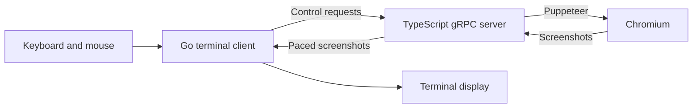

# Architecture

This page describes the current implementation. For planned changes, see [installation](plans/one-command-install.md) and [browser UI](plans/browser-ui.md).

## Browser and client

The TypeScript server controls a headless Chromium browser through Puppeteer. The Go client sends navigation, input, and viewport requests over gRPC and renders paced screenshots in the terminal.

The protocol lives in `proto/bc.proto`; Go and TypeScript bindings are generated during the build. Dialog events use a bidirectional stream.

## Renderers

- **Kitty:** requests PNG screenshots and sends the encoded image bytes through the Kitty graphics protocol. The preparation worker reads image dimensions to reject stale resize frames, then passes PNG bytes through without decoding pixels or re-encoding. Capture is capped at 24 frames per second and slows to measured preparation/output throughput.
- **Sixel:** decodes screenshots, quantizes colors, and encodes sixel output. Band-level caching reuses encoded regions when their contents are unchanged. Fixed palettes such as websafe support more stable caching.
- **tcell:** samples two colors per cell and draws a Unicode half block across the shared viewport. This is a screenshot renderer, not a DOM text browser.

The client uses `CaptureScreenshot` to bound outstanding capture requests. A single worker decodes and prepares immutable frames, with one pending raw frame and one pending prepared frame; newer work replaces pending work. Local chrome damage is independent of image damage. Unchanged frames reuse the prepared image, while overlay closure and document/viewport changes explicitly invalidate its displayed placement. Capture pauses when local overlays cover the page.

The legacy screenshot stream remains available and stops capture after `write(false)` until the stream drains. Both server viewports and client frame dimensions are limited to 16,384 pixels per side and 16 megapixels total; screenshots are limited to 32 MiB, with a matching gRPC receive limit. Committed page content remains visible while subresources are loading. Failed unary captures can recover without restarting the client. Terminal output stays in the UI owner; encoding workers never write terminal escape sequences. Physical terminal writes can still block, so their measured duration also limits capture pacing.

Sixel bands are six pixels high. Caching at that granularity follows the image format, but effectiveness depends on page changes, palette selection, and viewport size. Earlier README timing figures were not a cross-platform benchmark and should not be used as release guarantees.

`OPTIMUS.md` contains historical performance investigations, including items that may already be implemented. Confirm its suggestions against the current code before treating them as active tasks.

## Process and transport lifecycle

The client checks whether a server accepts connections, discovers its entry point, and launches Node if necessary. It watches stdout for `TERMIUM_READY`. That sentinel means the gRPC listener is available; browser startup happens later when requested.

Captures have an independent CDP session that is detached on navigation or after a bounded timeout. The shared capture/resize queue waits for the command to reject before continuing; it does not abandon a live command in a timer race. Input and history use a different session.

The server applies desktop viewport metrics directly to the active Chromium target. It serializes capture and resize, and reapplies the viewport after target replacement. This avoids Puppeteer's additional touch-emulation operations, which hung after modal dialogs in native macOS tests.

The default endpoint is `/tmp/termium.sock`, with optional TCP. The server maintains one global page and dialog stream. This does not provide isolated multi-client sessions.

Shutdown attempts to close the browser, server, connection, and terminal screen. Terminal probes have bounded deadlines. The event loop alone draws or finalizes the screen; workers post events and publish immutable frames into a latest-frame slot. A single client worker orders navigation, keys, mouse transitions, and resize requests. Browser input carries a document generation so queued input cannot act on a replacement page. Session isolation remains release work.

## Code map

| Location | Responsibility |
| --- | --- |
| `client/main.go` | Application lifecycle, terminal events, viewport, and rendering coordination |
| `client/config.go` | Flags and renderer selection |
| `client/server_launcher.go` | Server discovery and child process lifecycle |
| `client/keyboard.go`, `client/navigation_ui.go`, `client/text_editor.go` | Keyboard routing, navigation bar, menu, and Unicode editing |
| `client/mouse.go`, `client/input_dispatcher.go` | Mouse capture, keyboard pointer, and ordered input |
| `client/ui_layout.go`, `client/framebuffer.go` | Shared viewport geometry and immutable frame handoff |
| `client/frame_pipeline.go` | Bounded preparation, deduplication, Sixel encoding, and capture pacing |
| `client/kitty_renderer.go` | Kitty graphics encoding |
| `client/sixel_bands.go`, `client/sixel_band_encoder.go` | Sixel band processing and caching |
| `client/dialog.go`, `client/dialog_stream.go` | Browser and local dialogs |
| `server/src/server.ts`, `server/src/browser-controls.ts` | Puppeteer lifecycle, history/loading state, ordered input, and gRPC handlers |
| `proto/bc.proto` | Client/server protocol |

[Documentation home](README.md)
