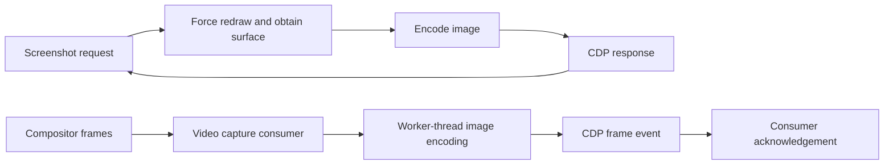

# Screenshot versus screencast: standalone proof of concept

This directory runs Puppeteer/CDP directly. It does **not** start or modify Termium's server, Go client, renderer, installer or website. Use it to investigate capture delivery, not terminal FPS.

The browser connection uses a local pipe (`pipe: true`). Each CDP frame event carries a complete base64 PNG/JPEG, just as it would over WebSocket; there is no raw-pixel or delta transport. See [streaming and raw-frame research](../../docs/performance/capture-streaming-and-raw-frames.md) for FPS controls, alternatives, and the post-release plan.

From a checkout with the project's Node dependencies installed:

```sh
PUPPETEER_EXECUTABLE_PATH=/path/to/chrome \
node experiments/cdp-streaming/run.mjs \
  --mode screenshot --format png --width 3840 --height 2160 \
  --warmup 3 --seconds 10 --out /tmp/screenshot-control

PUPPETEER_EXECUTABLE_PATH=/path/to/chrome \
node experiments/cdp-streaming/run.mjs \
  --mode stream --format png --width 3840 --height 2160 \
  --warmup 3 --seconds 10 --out /tmp/screencast-candidate

# Decode saved samples only after timing has finished.
PUPPETEER_EXECUTABLE_PATH=/path/to/chrome \
node experiments/cdp-streaming/check-samples.mjs /tmp/screencast-candidate
```

Output directories must be new. Linux is required for the small `/proc` resource sampler. No new npm dependencies are needed. Use `jpeg` to repeat with JPEG quality 60. For 720p use `--width 1280 --height 720`.

Both modes use the same seeded animated canvas and browser settings. The fixture derives from Termium's canvas benchmark and adds a 32-cell black/white frame marker. Screenshots use a persistent CDP session and sequential `Page.captureScreenshot` calls, with `optimizeForSpeed: true`. Streaming uses `Page.startScreencast`, receives `Page.screencastFrame`, then acknowledges the event's `sessionId` after the small sink has consumed the bytes. The matching Chromium implementation also selects its fast encoder for streaming; this was checked in the pinned source, not assumed from the API.

There is no 24 FPS consumer cap or adaptive pacing here. The fixture targets 30 animation updates/s. The sink base64-decodes and hashes each payload in both modes; image decoding, disk writes and sample validation occur outside the measured window. At most one image per second is retained. The stream sink is deliberately fast; this does not simulate Sixel's much slower consumer or establish production backpressure behavior.

Reports include arrivals/s, arrival intervals, bytes/s, payload changes, screenshot RPC timing, Node CPU, Linux process-tree CPU/sampled summed RSS, browser environment, and saved image samples. Payload digest changes are not proof of distinct visual frames. Sample validation decodes the marker to check dimensions and logical content progression, and estimates age of the logical animation state at receipt. It is **not** input-to-paint latency or exact compositor age; logical ticks precede drawing, and samples do not cover every frame.

For comparisons, use one host/browser/fixture, fresh browser per run, and screenshot → stream → stream → screenshot. Do not run a profiler concurrently. Resource sampling has overhead and misses the final CPU of processes exiting between samples; summed RSS includes shared-page double counting and saved samples. Treat small differences as inconclusive. Compare within this toy first; do not compare its rate directly with the recorded whole-Termium baseline.

Sources: [CDP Page API](https://chromedevtools.github.io/devtools-protocol/tot/Page/), [matching Chromium streaming implementation](https://github.com/chromium/chromium/blob/4999cc1efed37c4d91dc4ce6ec4b0a50e2a9a8cb/content/browser/devtools/protocol/page_handler.cc#L1578). The implementation receives compositor frames, uses a worker-thread image encoder and requires acknowledgements; it still produces encoded image payloads through CDP. This is not raw framebuffer access.

The paths being compared are:



Acknowledgement prevents the stream's in-flight allowance from filling. This toy consumes and acknowledges promptly; a production consumer would need explicit bounded ownership/drop behavior and tests for navigation, resize and shutdown.

Recorded experiment: [2026-09-28 ea results and tradeoffs](../../docs/performance/2026-09-28-streaming-poc.md). To reproduce its aggregate tables from the retained sixteen run directories, run `python3 experiments/cdp-streaming/analyze.py RESULTS_ROOT` after all runs and sample validations have completed. The result is `RESULTS_ROOT/summary.json`.
